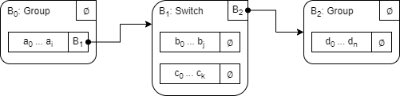
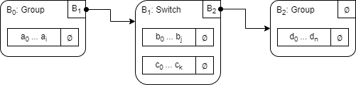
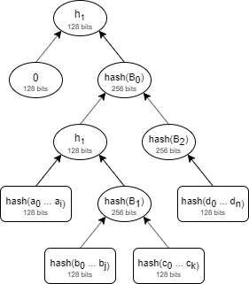

# Programs in Distaff VM
TODO

## Execution tree
Distaff programs can be thought of as execution trees of instructions. As a program is executed, a specific path through the tree is taken. The actual representation of a program is slightly more complex. For example, a program execution tree actually consists of instruction blocks each with its own structure and execution semantics. At the high level, there are two types of blocks: control blocks and code blocks. Both are explained below.

### Control blocks
Control blocks are used to specify flow control logic of a program. Currently, there are 3 types of control blocks: (1) group blocks, (2) switch blocks, and (3) loop blocks. Control blocks can contain one or more code blocks, and also have an optional `next` pointer which can be used to specify the next control block in a program. Specifics of each type of  control blocks are described below.

#### Group blocks
Besides the optional `next` pointer, a group block must contain a single code block. A data structure for a group block may look like so:
```
Group {
    content : CodeBlock,
    next?   : ControlBlock,
}
```
Execution semantics of a group block are as follows:
* First, `content` of the block is executed.
* Then, if `next` pointer is set, execution moves to the next block.

The purpose of a group block is to group a sequence of instructions together. This maybe useful, if you want to selectively reveal a part of an otherwise secret program.

#### Switch blocks
A switch block is used to describe conditional branching (i.e. *if/else* statements). Besides the optional `next` pointer, a switch block must contain code blocks for *true* and *false* branches of execution. A data structure for a switch block may look like so:
```
Switch {
    true_branch  : CodeBlock,
    false_branch : CodeBlock,
    next?        : ControlBlock,
}
```
Execution semantics of a switch block are as follows:
* If the top of the stack is `1`, `true_branch` is executed; if the top of the stack is `0`, `false_branch` is executed.
* Then, if `next` pointer is set, execution moves to the next block.

Switch block imposes the following restrictions on its content:
* `true_branch` must start with an `ASSERT` instruction. This guarantees that this branch can be executed only if the top of the stack is `1`.
* `false_branch` must start with `NOT ASSERT` instruction sequence. This guarantees that this branch can be executed only if the top of the stack is `0`.

#### Loop block
A loop block is used to describe a sequence of instructions which is to be repeated zero or more times based on some condition (i.e. *while* statement). Besides the optional `next` pointer, a loop block must contain a single code block. A data structure for a loop block may look like so:
```
Loop {
    content : CodeBlock,
    next?   : ControlBlock,
}
```
Execution semantics of a loop block are as follows:
* If the top of the stack is `1`, `content` block is executed.
* If after executing `content` block, the top of the stack is `1`, `content` block is executed again. This process is repeated until the top of the stack is `0`.
* Then, if `next` pointer is set, execution moves to the next block.

Loop block imposes the following restrictions on its content:
* `content` must start with an `ASSERT` instruction. This guarantees that it can be executed only if the top of the stack is `1`.

It is expected that at the end of executing `content` block, the top of the stack will contain a binary value (i.e. `1` or `0`). However, this is not enforced at program construction time, and if the top of the stack is not binary, the program will fail at execution time.

### Code blocks
A code block consists of a sequence of instructions to be executed and an optional `next` pointer which can be used to specify the next control block in a program.  A data structure for a code block may look like so:
```
CodeBlock {
    operations : Vector<u128>,
    next?      : ControlBlock,
}
```
Execution semantics of a code block are as follows:
* All `operations` of the block are executed first.
* Then, if `next` pointer is set, execution moves to the next block.

Code block imposes the following restrictions on its content:
* `operations` cannot be empty - i.e. it must contain at least one operation to be executed. Currently, operations are encoded into 128-bit values.

Having an optional `next` pointer enables nesting of control blocks. For example, a control block can contain a code block, which in turn points to another control block and so on. Concrete examples of this are explored in the following section.

## Example programs

### Linear program
The simplest program is a linear sequence of instructions with no branches or loops:
```
a0, a1, ..., a_i
```
where, a<sub>0</sub>, a<sub>1</sub> etc. are instructions executed one after the other. Such a program can be described by a single group block like so:

<p align="center">
    
</p>
To briefly explain the diagram:

* The rectangle with rounded corners represents a control block. In this case, it is a group block B<sub>0</sub>.
* The `next` pointer of this block is null. This is indicated by `∅` in the top right corner of the rectangle.
* The group block contains a code block with instructions a<sub>0</sub> . . . a<sub>i</sub>, and a `next` pointer set to `∅` (null).

### Program with branches
Let's add some conditional logic to our program. The program below does the following:
* First, instructions a<sub>0</sub> . . . a<sub>i</sub> are executed.
* Then, if the top of the stack is `1`, instructions b<sub>0</sub> . . . b<sub>j</sub> are executed. But if the top of the stack is `0`, instructions c<sub>0</sub> . . . c<sub>k</sub> are executed.
* Finally, instructions d<sub>0</sub> . . . d<sub>n</sub> are executed.

```
a0, a1, ..., a_i
if.true
    b0, b1, ..., b_j
else
    c0, c1, ..., c_k
end
d0, d1, ..., d_n
```
A diagram for this program would look like so:

<p align="center">
    
</p>

Here, we have 3 control blocks, one describing the initial sequence of instructions, another one describing the *if/else* statement, and the last block describing the final sequence of instructions. The blocks are linked via `next` pointers like so:

* The `next` pointer of the code block within B<sub>0</sub> block points to B<sub>1</sub> block.
* The `next` pointer of the B<sub>1</sub> block points to B<sub>2</sub> block directly.

### Programs with nested blocks
Let's add nested control logic to our program. The program below is the same as the program from the previous example, except the *else* clause of the *if/else* statement now also contains a loop. This loop will keep executing instructions d<sub>0</sub> . . . d<sub>n</sub> as long as the top of the stack is `1` right after instruction d<sub>n</sub> is executed. Once, the top of the stack becomes `0`, instructions e<sub>0</sub> . . . e<sub>m</sub> are executed.
```
a0, a1, ..., a_i
if.true
    b0, b1, ..., b_j
else
    c0, c1, ..., c_k
    while.true
        d0, d1, ..., d_n
    end
    e0, e1, ..., e_m
end
f0, f1, ..., f_l
```
A diagram for this program would look like so:

<p align="center">
    
</p>

Here, we have 5 control blocks, where blocks B<sub>2</sub> and B<sub>3</sub> are nested within the *else* branch of block B<sub>1</sub>.

## Program hash
All Distaff programs can be reduced to a 16-byte hash represented by a single element in a 128-bit field. The hash is designed to target 128-bit preimage and second preimage resistance, and 64-bit collision resistance.

Program hash is computed incrementally. That is, it starts out as `0`, and with every consecutive program block, program hash is updated to include hash of that block.

For example, let's say our program consists of 3 blocks and looks like so:

<p align="center">
    
</p>

Let's also define hash of block B<sub>n</sub> as *hash(B<sub>n</sub>)*, and hash of the program before block *B<sub>n</sub>* is "merged" into it as *h<sub>n</sub>*. Then, hash of the entire program is computed like so:

1. First, we set *h<sub>0</sub> = 0*.
2. Then, we compute *h<sub>1</sub> = hash_acc(h<sub>0</sub>, hash(B<sub>0</sub>))*, where *hash_acc* is the function for merging block hashes into program hash (see [here](#hash_acc-procedure)).
3. Then, we compute *h<sub>2</sub> = hash_acc(h<sub>1</sub>, hash(B<sub>1</sub>))*.
4. Finally, we compute *h<sub>3</sub> = hash_acc(h<sub>2</sub>, hash(B<sub>2</sub>))*, which is our program hash.

Graphically, this looks like so:

<p align="center">
    
</p>

This is a Merkle tree (though lopsided). In fact, all program hashes are roots of Merkle trees, where the shape of the tree is defined by program structure. This is by design. Using this property or program hashes, we can selectively reveal any of the program blocks while keeping the rest of the program private.

### Computing hash of a program block
In the section above, we described how to compute hash of the entire program from hashes of individual program blocks. In this section, we'll describe how to compute hashes for different types of program blocks.

#### Hashes of control blocks
Hash of a control block is defined as a tuple of two 128-bit elements (v<sub>0</sub>, v<sub>1</sub>). It is computed by recursively hashing the content of the control block as follows:

For **group blocks**, we set v<sub>0</sub> to the hash of the code block contained within the group block, and set v<sub>1</sub> to `0`. Specifically:
* *v<sub>0</sub> = hash(content)*
* *v<sub>1</sub> = 0*

For **switch blocks**, since there are 2 code blocks (one for each branch), we set v<sub>0</sub> and v<sub>1</sub>, to the hashes of the branches respectively. Specifically:
* *v<sub>0</sub> = hash(true_branch)*
* *v<sub>1</sub> = hash(false_branch)*

For **loop blocks**, hashing is a bit more nuanced. First, we define an *exit block*, which is just a group block containing `NOT ASSERT` sequence of instructions. Then we compute v<sub>0</sub> and v<sub>1</sub> as follows:
* *v<sub>0</sub> = hash(content)*
* *v<sub>1</sub> = hash(exit block)*

#### Hashes of code blocks


For **code blocks**:
* *v<sub>0</sub> = hash_acc(hash_ops(operations), hash(next))*
* *v<sub>1</sub> = 0*

### hash_acc procedure
The purpose of *hash_acc()* function is to merge hash of a control block into the running program hash. Recall that hash of a control block is represented by two 128-bit elements, while hash of the program is represented by one 128-bit element. The output of *hash_acc()* is a single 128-bit element.

Denoting *(v<sub>0</sub>, v<sub>1</sub>)* to be the hash of the control block to be merged, and *h* to be the current hash of the program, high-level pseudo-code for *hash_acc()* function looks like so:
```
let state = [v0, v1, h, 0];
for 16 rounds do:
    state = add_round_constants(state);
    state = apply_sbox(state);
    state = apply_mds(state);
    state = add_round_constants(state);
    state = apply_inverse_sbox(state);
    state = apply_mds(state);
return state[0];
```

### hash_ops procedure
The purpose of *hash_ops()* function is to hash a sequence of instructions into a single 128-bit element. The pseudo-code for this function is as follows:

```
let state = [0, 0, 0, 0];
for each op_code in instructions do:
    state = hash_ops_round(state, op_code);
return state[0];
```
where:
  * `state` is an array of four 128-bit field elements,
  * `instructions` is a vector of 128-bit field elements,
  * `hash_ops_round()` is a function which merges `op_code` into the state. The specifics of this function are currently TBD.

## Program hash computations
Distaff VM computes program hash as the program is executed on the VM. Several components of the VM are used in hash computations. These components are:

* **sponge state** which is used by *hash_acc* and *hash_ops* procedures; sponge state takes up 4 registers.
* **block stack** which holds hashes of currently executing blocks; block stack takes up between 1 and 16 registers (depending on the level of nesting in the program).
* **loop stack** which holds images of loop contents for loops that are currently executing; loop stack takes up between 0 and 8 registers.

### Flow control instructions

Flow control instructions are used to manipulate these components 

#### BEGIN instruction
Indicates start of a new control block. Pushes value from the first register of the `sponge state` onto the `block stack`, and then sets all registers of `sponge state` to `0`.
```
╒═══ sponge ═══╕  ╒═ block stack ═╕
[s0, s1, s2, s3], [               ]
                🡣
[ 0,  0,  0,  0], [s0             ]
```

#### TEND instruction
Indicates end of a control block. This instruction accepts a single parameter `x`. The instruction performs the following actions:
1. Keeps the 1st register of `sponge state` as is.
2. Sets the 2nd register of `sponge state` to `x`.
3. Pops a value from `block stack` and copies it to the 3rd register of `sponge state`.
4. Sets the 4th register of `sponge state` to `0`.
```
╒═══ sponge ═══╕  ╒═ block stack ═╕
[s0, s1, s2, s3], [b0             ]
                🡣
[s0,  x, b0,  0], [               ]
```

#### FEND instruction
TODO
```
╒═══ sponge ═══╕  ╒═ block stack ═╕
[s0, s1, s2, s3], [b0             ]
                🡣
[s0,  x, b0,  0], [               ]
```

#### LOOP instruction
TODO

#### CONTINUE instruction
TODO

#### BREAK instruction
TODO