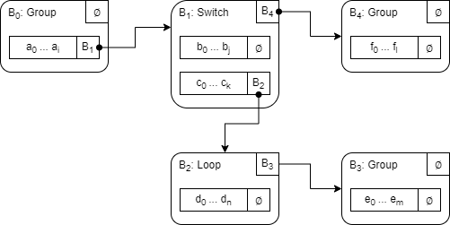

# Programs in Distaff VM
TODO

## Execution tree
Distaff programs can be thought of as execution trees of instructions. As a program is executed, a specific path through the tree is taken. The actual representation of a program is slightly more complex. For example, a program execution tree actually consists of instruction blocks each with its own structure and execution semantics. At the high level, there are two types of blocks: control blocks and code blocks. Both are explained below.

### Control blocks
Control blocks are used to specify flow control logic of a program. Currently, there are 3 types of control blocks: (1) group blocks, (2) switch blocks, and (3) loop blocks. Control blocks can contain one or more code blocks, and also have an optional `next` pointer which can be used to specify the next control block in a program. Specifics of each type of  control blocks are described below.

#### Group blocks
Besides the optional `next` pointer, a group block must contain a single code block. A data structure for a group block may look like so:
```
Group {
    content : CodeBlock,
    next?   : ControlBlock,
}
```
Execution semantics of a group block are as follows:
* First, `content` of the block is executed.
* Then, if `next` pointer is set, execution moves to the next block.

The purpose of a group block is to group a sequence of instructions together. This maybe useful, if you want to selectively reveal a part of an otherwise secret program.

#### Switch blocks
A switch block is used to describe conditional branching (i.e. *if/else* statements). Besides the optional `next` pointer, a switch block must contain code blocks for *true* and *false* branches of execution. A data structure for a switch block may look like so:
```
Switch {
    true_branch  : CodeBlock,
    false_branch : CodeBlock,
    next?        : ControlBlock,
}
```
Execution semantics of a switch block are as follows:
* If the top of the stack is `1`, `true_branch` is executed; if the top of the stack is `0`, `false_branch` is executed.
* Then, if `next` pointer is set, execution moves to the next block.

Switch block imposes the following restrictions on its content:
* `true_branch` must start with an `ASSERT` instruction. This guarantees that this branch can be executed only if the top of the stack is `1`.
* `false_branch` must start with `NOT ASSERT` instruction sequence. This guarantees that this branch can be executed only if the top of the stack is `0`.

#### Loop block
A loop block is used to describe a sequence of instructions which is to be repeated zero or more times based on some condition (i.e. *while* statement). Besides the optional `next` pointer, a loop block must contain a single code block. A data structure for a loop block may look like so:
```
Loop {
    content : CodeBlock,
    next?   : ControlBlock,
}
```
Execution semantics of a loop block are as follows:
* If the top of the stack is `1`, `content` block is executed.
* If after executing `content` block, the top of the stack is `1`, `content` block is executed again. This process is repeated until the top of the stack is `0`.
* Then, if `next` pointer is set, execution moves to the next block.

Loop block imposes the following restrictions on its content:
* `content` must start with an `ASSERT` instruction. This guarantees that it can be executed only if the top of the stack is `1`.

It is expected that at the end of executing `content` block, the top of the stack will contain a binary value (i.e. `1` or `0`). However, this is not enforced at program construction time, and if the top of the stack is not binary, the program will fail at execution time.

### Code blocks
A code block consists of a sequence of instructions to be executed and an optional `next` pointer which can be used to specify the next control block in a program.  A data structure for a code block may look like so:
```
CodeBlock {
    operations : Vector<u128>,
    next?      : ControlBlock,
}
```
Execution semantics of a code block are as follows:
* All `operations` of the block are executed first.
* Then, if `next` pointer is set, execution moves to the next block.

Code block imposes the following restrictions on its content:
* `operations` cannot be empty - i.e. it must contain at least one operation to be executed. Currently, operations are encoded into 128-bit values.

Having an optional `next` pointer enables nesting of control blocks. For example, a control block can contain a code block, which in turn points to another control block and so on. Concrete examples of this are explored in the following section.

## Example programs

### Linear program
The simplest program is a linear sequence of instructions with no branches or loops:
```
a0, a1, ..., a_i
```
where, a<sub>0</sub>, a<sub>1</sub> etc. are instructions executed one after the other. Such a program can be described by a single group block like so:

<p align="center">
    
</p>
To briefly explain the diagram:

* The rectangle with rounded corners represents a control block. In this case, it is a group block B<sub>0</sub>.
* The `next` pointer of this block is null. This is indicated by `∅` in the top right corner of the rectangle.
* The group block contains a code block with instructions a<sub>0</sub> . . . a<sub>i</sub>, and a `next` pointer set to `∅`.

### Program with branches
Let's add some conditional logic to our program. The program below does the following:
* First, instructions a<sub>0</sub> . . . a<sub>i</sub> are executed.
* Then, if the top of the stack is `1`, instructions b<sub>0</sub> . . . b<sub>j</sub> are executed. But if the top of the stack is `0`, instructions c<sub>0</sub> . . . c<sub>k</sub> are executed.
* Finally, instructions d<sub>0</sub> . . . d<sub>n</sub> are executed.

```
a0, a1, ..., a_i
if.true
    b0, b1, ..., b_j
else
    c0, c1, ..., c_k
end
d0, d1, ..., d_n
```
A diagram for this program would look like so:

<p align="center">
    
</p>

Here, we have 3 control blocks, one describing the initial sequence of instructions, another one describing the *if/else* statement, and the last block describing the final sequence of instructions. The blocks are linked via `next` pointers like so:

* The `next` pointer of the code block within B<sub>0</sub> block points to B<sub>1</sub> block.
* The `next` pointer of the B<sub>1</sub> block points to B<sub>2</sub> block directly.

### Programs with nested blocks
Let's add some nesting to our program. The program below is the same as the program from the previous example, except the *else* clause of the *if/else* statement now also contains a loop. This loop will keep executing instructions d<sub>0</sub> . . . d<sub>n</sub> as long as the top of the stack is `1` right after instruction d<sub>n</sub> is executed.
```
a0, a1, ..., a_i
if.true
    b0, b1, ..., b_j
else
    c0, c1, ..., c_k
    while.true
        d0, d1, ..., d_n
    end
    e0, e1, ..., e_m
end
f0, f1, ..., f_l
```
A diagram for this program would look like so:

<p align="center">
    
</p>

## Program hash
Each Distaff program can be reduced to 16-byte hash value represented by a single element in a 128-bit field. This hash is computed as follows:

TODO

## Program execution semantics

TODO